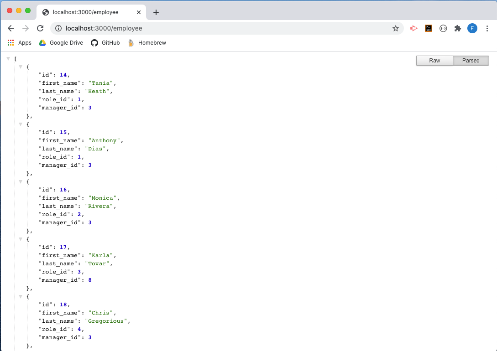
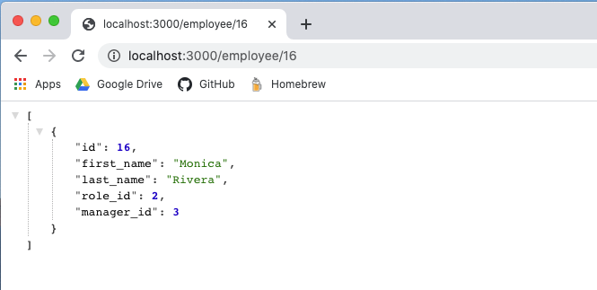
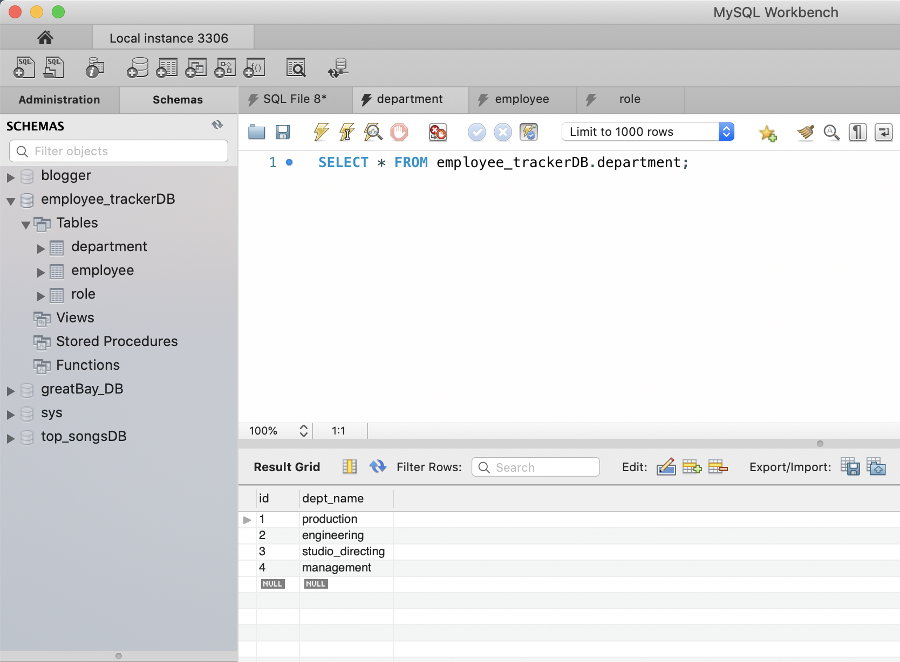
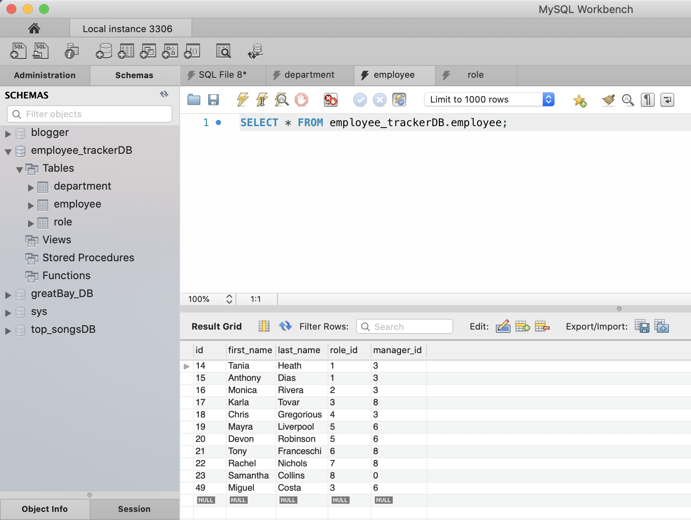
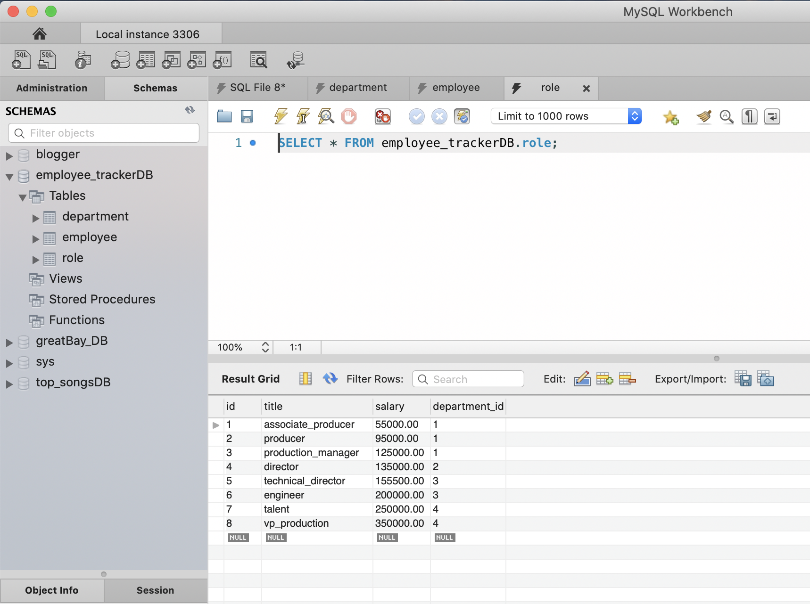
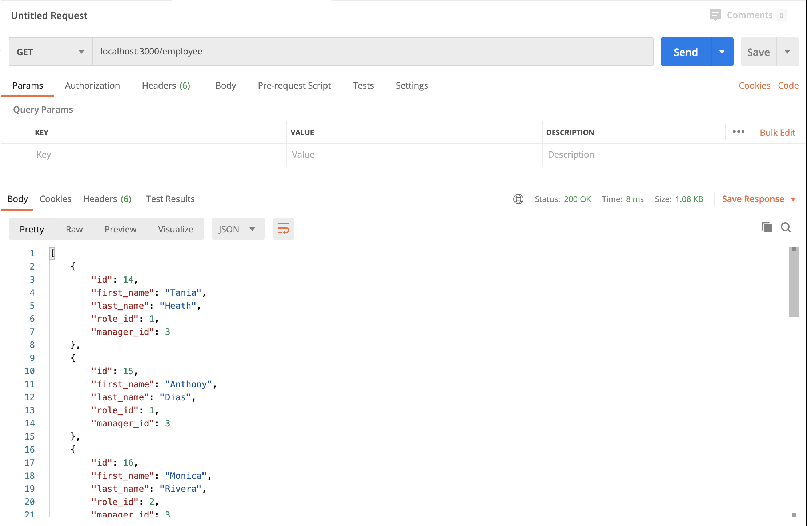
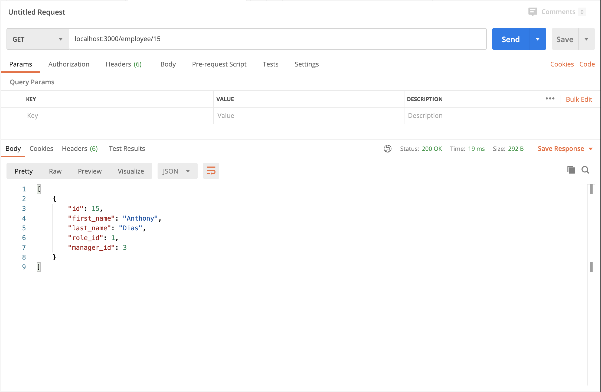
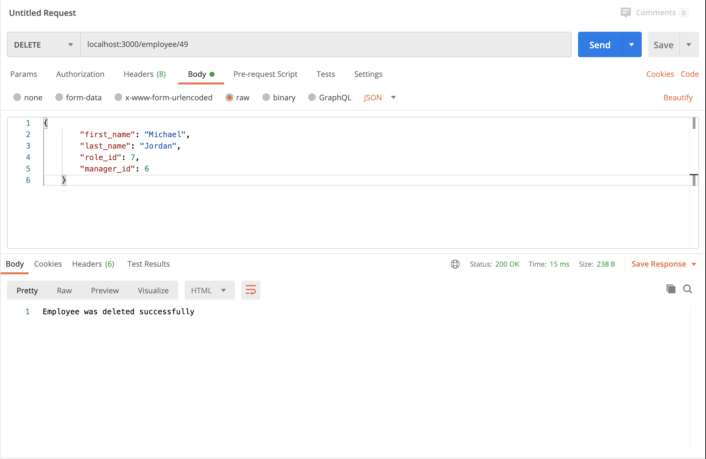

# Employee-Tracker

         
    
## Description
In this homework assignment, your challenge is to architect and build a solution for managing a company's employees using node, inquirer, and MySQL.

## Table of Content
- [usage](#usage)
- [licenses](#licenses)
- [contribution](#contribution)
- [test](#test)
- [email](#email)
   
### usage: 
  - This application will be used to manage and maintain a company database where the user can view, add, delete, update and track all the employees of a specific corporation.
 
### licenses: 
  - MIT
    
### contribution: 
  - Developer
    
### test: 
  - To test this application you need to clone the repo.
  - Run index.js file in terminal.

  - The user can select from the displayed options to view the different categories:
      * View all employees
      * View all employees by department
      * View all employees by manager
      * View all roles
      * Add employee 
      * Remove employee 
      * Update employee role
      * Update employee manager

  - Also available via localhost:
      * List of all employees via localhost:3000/employee

  

       * Single employee entry via localhost:3000/employee/(employee id #)

       

  - In mySql you can see all three requested tables:

    

    

    

  - The functions where also tested via Postman to confirm app.get / delete / post /put.

        * Get all employees list via Postman

   

        * Get single employee via Postman using Id

   

        * Confirmation of added employee via Postman

   

        * Confirmation of deleted employee via Postman

   

  - A successful application will allow the user to complete all views plus add, delete and update content as needed.
    
### email: 
  - bpr59@comcast.net

### inquires:
For question about this project, please contact the developer via Github username: bpr59 or by email bpr59@comcast.net 

